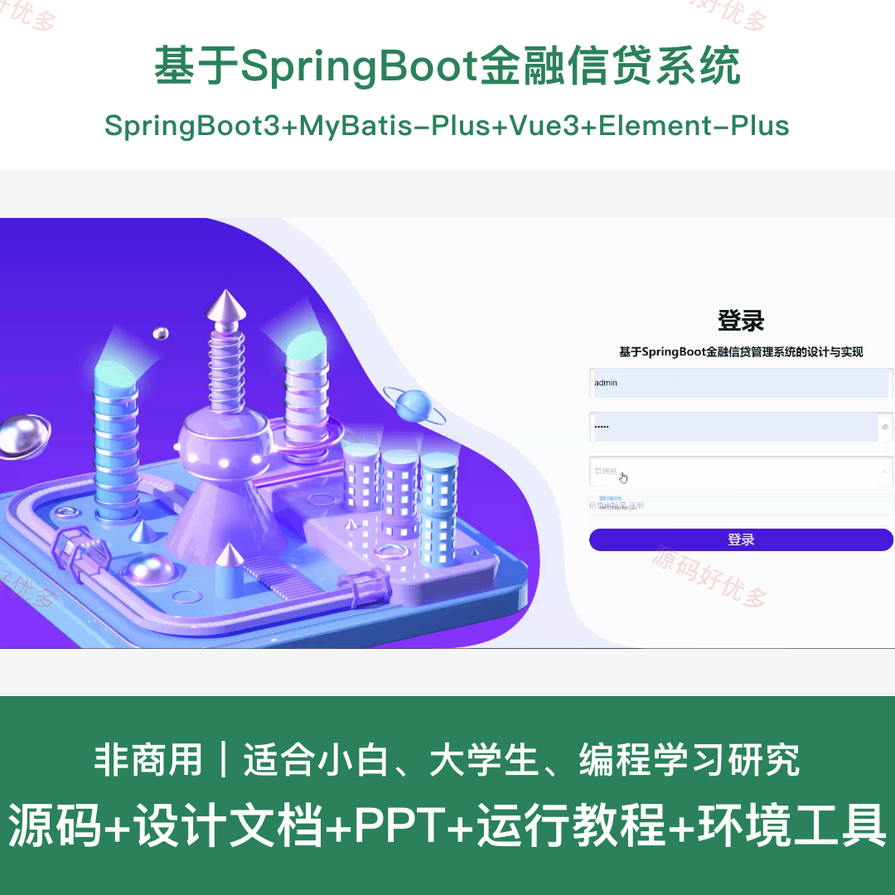
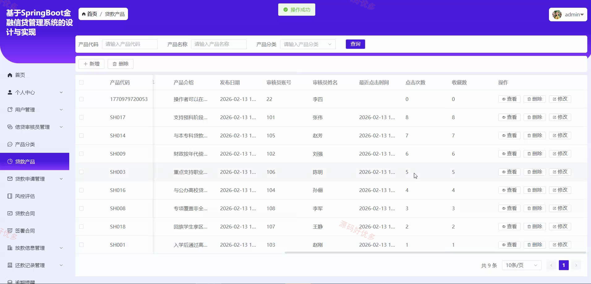
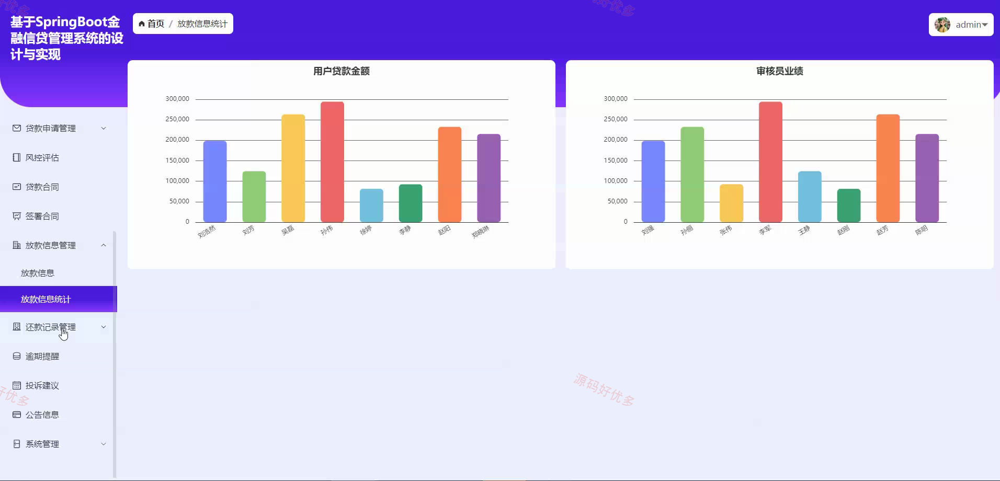
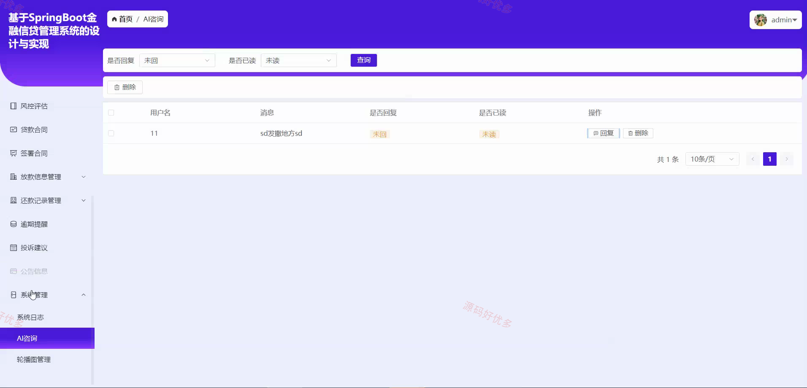
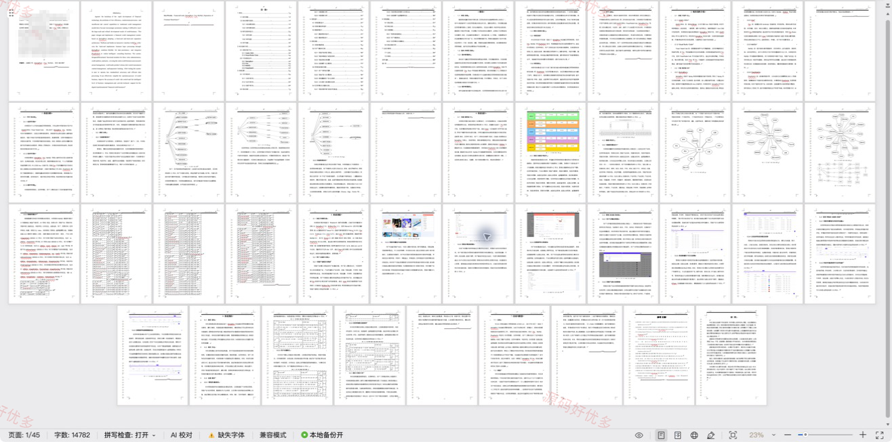

## 源码问题查看主页咨询

### 一、关键词
金融信贷管理、贷款申请、风险评估、合同放款、还款管理

### 二、作品包含
源码+数据库+设计文档+PPT+全套环境和工具资源+本地部署教程

### 三、项目技术
前端技术： Html、Css、Js、Vue3.5、Element-Plus
后端技术：Java、SpringBoot3.3.0、MyBatis-Plus

### 四、运行环境（以下版本亲测，其他版本兼容性请自行测试）
开发工具：IDEA/eclipse + VSCODE

数据库：MySQL8.0+（共21张表）

数据库管理工具：Navicat10以上版本

环境配置软件： JDK17 + Maven3.6.3

前端Nodejs：16+

浏览器：谷歌浏览器

### 五、项目介绍
项目编号：springbootA682D

基于SpringBoot金融信贷管理系统面向用户、信贷审核员和管理员，覆盖贷款产品查询、贷款申请、风险评估、合同签署、放款、还款及逾期提醒等信贷业务流程。

角色：用户、信贷审核员、管理员

用户功能：登录注册与个人资料维护、贷款产品浏览及沟通申请、公告信息查看、贷款申请查询与沟通、风控评估结果查看、贷款合同查看与签署、放款信息查看与还款、还款记录与逾期提醒及投诉收藏。

信贷审核员功能：登录注册与个人资料维护、贷款产品查看、贷款申请审核与沟通、贷款风险评估、贷款合同生成与管理、签署合同放款、还款记录与逾期提醒管理、用户贷款及审核员业绩统计。

管理员功能：用户与信贷审核员管理、产品分类与贷款产品管理、贷款申请与风控评估管理、贷款合同与签署合同管理、放款还款及逾期提醒管理、投诉建议与公告管理、用户贷款及审核员统计、轮播图系统日志及AI咨询管理。

### 六、运行截图

